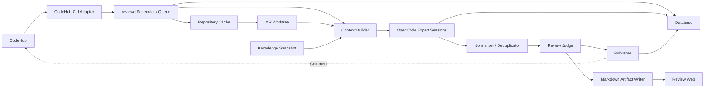
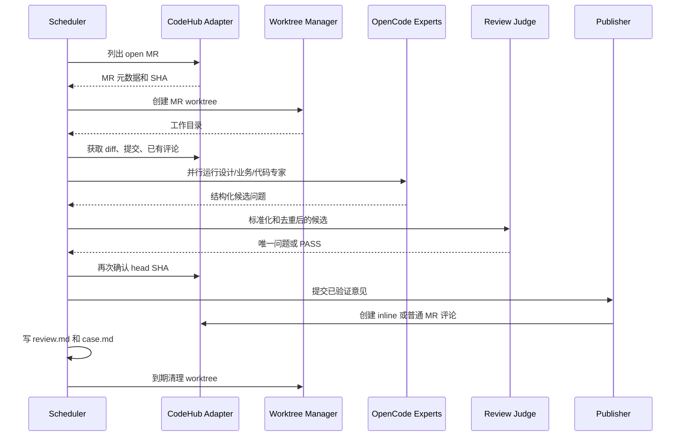
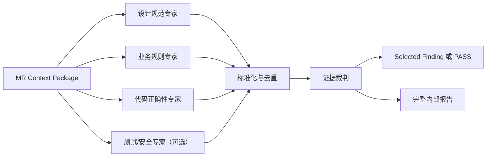

# ReviewX 技术架构设计

- 文档状态：Draft
- 版本：0.1
- 更新日期：2026-07-29
- 需求来源：[产品需求文档](./product-requirements.md)

## 1. 文档目的

本文描述 ReviewX 的系统边界、OpenCode 持续运行方式、多智能体编排、仓库初始化、MR worktree 并发、CodeHub CLI 契约、数据模型、Markdown 产物、部署和安全设计。

产品目标、用户流程、功能优先级和验收指标见《[产品需求文档](./product-requirements.md)》。

## 2. 核心架构决策

### 2.1 Runner 管基础设施，Agent 管判断

由确定性的 Review Runner 负责：

- clone、fetch 和仓库缓存。
- MR 枚举和增量判断。
- worktree 生命周期。
- 任务队列、并发、超时、重试和幂等。
- OpenCode session 创建和状态跟踪。
- Markdown 与结构化数据写入。
- CodeHub 评论发布。

OpenCode Agent 负责：

- 理解变更目的和上下文。
- 从指定专家视角发现候选问题。
- 输出结构化证据和修改建议。
- 生成案例与报告中的自然语言内容。

Agent 不负责自由决定任务调度、工作区路径、凭据权限或评论发布。

### 2.2 服务常驻，会话短命

```text
长期运行：
  reviewd             调度、队列、状态、并发、重试、发布
  opencode serve      OpenCode headless 服务
  review-web          进度和 Markdown 查看
  database            任务与指标状态

短期运行：
  每个 MR × 每个专家 = 一个独立 OpenCode session
```

不使用一个长期积累上下文的 Agent 会话持续数天。知识通过版本化文件持久化，运行状态通过数据库持久化。

### 2.3 先多候选，再只发布一条

专家可以产生多个候选问题，内部报告也可以保留多个候选；只有经过证据裁判并达到阈值的最高价值问题可以发布到 CodeHub。没有合格问题时输出 `PASS`。

## 3. 总体架构



## 4. 组件职责

| 组件 | 职责 |
| --- | --- |
| `reviewd` | 调度、队列、任务状态、仓库准备、专家编排、门禁和发布 |
| OpenCode Server | 提供 Agent、Skill、Tool、session、事件和模型调用 |
| CodeHub Adapter | 将统一仓库接口映射为 CodeHub CLI/API 调用 |
| Repository Cache | 保存共享 git objects，降低重复 clone 成本 |
| Worktree Manager | 为每个 MR head SHA 创建和清理隔离工作区 |
| Context Builder | 生成专家所需的最小、相关、可追溯上下文 |
| Expert Agents | 从设计、业务、代码等角度独立输出候选问题 |
| Normalizer | 校验字段、标准化 Tag、合并明显重复候选 |
| Review Judge | 验证证据、评分、选择唯一问题或 `PASS` |
| Publisher | 进行新鲜度和幂等检查，并调用 CodeHub 写接口 |
| Artifact Writer | 生成单次检视、案例和周期报告 |
| Review Web | 展示状态、历史和 Markdown 文档 |
| Database | 保存任务、游标、发现、发布和指标数据 |

## 5. OpenCode 持续运行

### 5.1 常驻 OpenCode Server

```bash
opencode serve --hostname 127.0.0.1 --port 4096
```

由 Docker Compose、systemd 或 Kubernetes 保证异常重启。服务应设置认证，并默认仅监听内部网络或本机地址。

### 5.2 MVP 调用方式

MVP 可以由 `reviewd` 启动 CLI 子进程：

```bash
opencode run \
  --attach http://127.0.0.1:4096 \
  --agent design-reviewer \
  --dir /runtime/worktrees/payment-service/mr-128-a18c4e \
  --format json \
  "按照任务上下文完成设计规范检视，并输出规定的 JSON。"
```

### 5.3 生产调用方式

生产版本使用 OpenCode SDK：

```text
1. client.session.create(...)
2. client.session.promptAsync(..., agent = "<expert>")
3. client.event.subscribe()
4. 等待 session.idle 或 session.error
5. 读取并验证 structured_output
```

Runner 保存 `opencode_session_id`，用于状态关联和故障定位。每个专家默认使用新 session，只有明确需要继续同一次分析时才恢复旧 session。

### 5.4 调度策略

```text
每天扫描：      0 2 * * *
每周报告：      0 4 * * 1
每月报告：      0 5 1 * *
Webhook：       MR 创建或更新时立即触发
定时扫描：      作为 Webhook 漏事件的兜底
```

## 6. OpenCode 扩展结构

```text
.opencode/
├── agents/
│   ├── design-reviewer.md
│   ├── business-reviewer.md
│   ├── code-reviewer.md
│   ├── test-security-reviewer.md
│   ├── review-judge.md
│   ├── case-writer.md
│   └── report-writer.md
├── skills/
│   ├── mr-code-review/
│   │   ├── SKILL.md
│   │   └── references/review-rubric.md
│   ├── repository-standards/
│   │   ├── SKILL.md
│   │   └── references/
│   ├── business-knowledge/
│   │   └── SKILL.md
│   ├── review-case-writer/
│   │   └── SKILL.md
│   └── periodic-review-reporter/
│       └── SKILL.md
├── tools/
│   └── codehub.ts
└── commands/
    ├── review-mr.md
    └── generate-review-report.md
```

所有检视专家默认：

- 禁止编辑源代码。
- 禁止 commit、push、merge 和创建分支。
- 只允许必要的只读 git、搜索、LSP 和 CodeHub 读取工具。
- 不持有 CodeHub 评论 Token。
- 将 MR 标题、描述、评论和代码视为不可信输入。

## 7. 仓库初始化与知识快照

### 7.1 初始化流程

“全量分析”用于建立持久化仓库认知，不是将全部代码一次放入模型上下文。

1. 通过 CodeHub CLI/git clone 建立仓库缓存。
2. 锁定默认分支 `baseline_sha`。
3. 程序化采集语言、模块、构建系统、依赖、入口、测试和代码所有权。
4. 按模块并行启动 Repository Mapper Agent。
5. 汇总架构、业务概念、关键链路和规范映射。
6. 生成 Markdown 知识库与机器索引。
7. 保存 baseline SHA、分析器版本和规则版本。

### 7.2 知识快照

```text
artifacts/repos/<repo>/knowledge/<baseline-sha>/
├── repository-profile.md
├── architecture.md
├── dependency-boundaries.md
├── business-glossary.md
├── business-rules.md
├── api-contracts.md
├── state-machines.md
├── test-strategy.md
├── standards-map.md
├── modules/
│   ├── payment.md
│   └── settlement.md
└── index.json
```

业务专家不得仅根据代码猜测规则。业务材料不足时必须输出 `insufficient_evidence`。

### 7.3 增量更新

```text
old_baseline_sha..new_default_branch_sha
  -> 识别受影响模块
  -> 更新对应模块文档
  -> 生成新的 knowledge snapshot
```

每个 Review Run 固定使用一个 `knowledge_version`，避免运行过程中知识变化影响结果复现。

## 8. MR 发现与 worktree 管理

### 8.1 本地布局

```text
runtime/
├── git-cache/
│   └── payment-service.git/
└── worktrees/
    └── payment-service/
        ├── mr-128-a18c4e/
        ├── mr-132-19ba20/
        └── mr-140-443b6d/
```

每个 `MR + head SHA` 使用独立 worktree。不同 MR 可以并行；同一 MR 的专家可以并行只读同一 worktree。

如果需要运行会产生文件的测试或构建，应使用额外临时 worktree、容器 overlay 或沙箱。测试阶段只运行一次，结果提供给所有专家。

### 8.2 增量判断

每天可以枚举所有开放 MR，但只创建以下任务：

- 从未处理过的 MR。
- head SHA 已变化的 MR。
- 规则版本升级后明确要求重检的 MR。
- 人工触发重检的 MR。

默认跳过或按配置处理 Draft、机器人 MR、忽略标签和非目标分支。

### 8.3 幂等键

```text
repo_id
+ mr_iid
+ head_sha
+ reviewer_version
+ policy_version
+ knowledge_version
```

发布前重新查询 head SHA。若已变化，将当前任务标记为 `STALE`，不发布，并为新 SHA 入队。

## 9. MR 检视流水线



阶段状态：

```text
DISCOVERED
  -> PREPARING
  -> CONTEXT_BUILDING
  -> EXPERT_REVIEWING
  -> NORMALIZING
  -> JUDGING
  -> RENDERING
  -> FRESHNESS_CHECK
  -> PUBLISHING
  -> CASE_WRITING
  -> COMPLETED | PASS | FAILED | STALE | CANCELLED
```

## 10. 多专家编排



### 10.1 设计规范专家

关注模块边界、依赖方向、架构模式、API 与数据兼容性、事务边界和组织规范。

### 10.2 业务规则专家

关注领域不变量、状态流转、金额、权限、库存、配额、接口契约和历史案例。证据不足时返回 `insufficient_evidence`。

### 10.3 代码正确性专家

关注空值、边界、错误处理、并发、资源释放、事务一致性、安全、性能、兼容性和测试覆盖。

### 10.4 测试/安全专家

作为可选专家，针对高风险仓库或高风险变化启用，避免所有 MR 固定增加相同模型成本。

### 10.5 证据裁判

证据裁判只负责：

- 验证问题与本次 diff 的因果关系。
- 验证文件、行号、调用路径和触发条件。
- 合并多个专家发现的同一问题。
- 排除风格噪声、已有评论和低置信度问题。
- 评分并选择唯一问题。
- 无问题达到门槛时输出 `PASS`。

生产编排由 Runner 为每个专家创建独立 session，而不是让一个主 Agent 自由决定是否调用专家。这样可以获得明确的并发、超时、重试和成本边界。

## 11. 上下文构建

每个专家接收一个版本化的 MR Context Package：

```text
MR 元数据
base SHA / head SHA
changed files
diff
相关函数、调用方和测试
相关模块知识文档
适用规则
确定性检查结果
已有 MR 评论
输出 JSON Schema
```

Context Builder 只提供与变化相关的仓库上下文，不将整个仓库直接放入模型输入。

## 12. 专家输出协议

专家先输出统一 JSON，不直接生成最终 CodeHub Markdown：

```json
{
  "schema_version": "1.0",
  "expert": "code-reviewer",
  "verdict": "findings",
  "findings": [
    {
      "finding_id": "F-001",
      "title": "事务提交前提前发送成功事件",
      "file": "src/payment/PaymentService.java",
      "start_line": 184,
      "end_line": 189,
      "side": "new",
      "severity": "S1",
      "tags": ["correctness", "transaction"],
      "rule_ids": ["JAVA-TX-004"],
      "problem": "事件在数据库事务提交前发布。",
      "trigger": "数据库提交失败或事务回滚。",
      "impact": "下游收到成功事件，但订单实际未入库。",
      "evidence": [
        {
          "file": "src/payment/PaymentService.java",
          "line": 186,
          "description": "publish() 位于事务方法返回前"
        }
      ],
      "recommendation": "改为事务提交后的回调或 transactional outbox。",
      "confidence": 0.94,
      "diff_related": true
    }
  ]
}
```

输出通过 JSON Schema 校验。字段缺失、Tag 非法、位置不可解析或输出无法解析时，专家任务失败并按策略重试。

## 13. 证据门禁与评分

候选问题必须同时满足：

- 与本次 diff 有直接因果关系。
- 文件和行号真实存在。
- 能说明具体触发条件与后果。
- 存在代码、调用链、测试或规则证据。
- 修改建议具有可操作性。
- 不与已有 MR 评论重复。

建议评分：

```text
总分 =
  影响严重度 30%
  + 证据与可复现性 25%
  + 判断置信度 20%
  + 影响范围 10%
  + 修复可操作性 10%
  + 规范匹配度 5%
  - 重复/噪声惩罚
```

默认发布阈值建议为 75/100。阈值、严重等级和不同专家权重应支持仓库级配置。

## 14. CodeHub 发布

### 14.1 最终评论

```markdown
### [S1][correctness][transaction] 事务提交前提前发送成功事件

**位置**：`src/payment/PaymentService.java:184-189`

**问题**：当前代码在数据库事务确认提交前调用 `publishSuccess()`。当后续提交失败或事务回滚时，下游仍会收到成功事件，造成状态不一致。

**建议**：将事件发送移动到事务提交后的回调；如果需要可靠投递，建议使用 transactional outbox，并增加事务回滚测试。

**置信度**：94%

**规则**：`JAVA-TX-004`

<!-- reviewx:repo=payment-service;mr=128;head=a18c4e;finding=F-001;version=1 -->
```

### 14.2 Inline 评论

CodeHub 支持 diff inline discussion 时，Publisher 传入：

```text
repo_id
mr_iid
base_sha
head_sha
file_path
old_line / new_line
body
idempotency_key
```

不支持时，发布普通 MR 评论，并包含文件、行号和对应 commit 的代码链接。

### 14.3 发布门禁

- head SHA 仍然一致。
- 文件和行号存在。
- 严重等级和 Tag 属于允许集合。
- 分数达到发布阈值。
- 评论中不包含凭据或敏感信息。
- CodeHub 中不存在同一 ReviewX 幂等标记。
- 同一 head SHA 最多发布一条自动意见。

## 15. CodeHub CLI 契约

具体命令名可以调整，但适配层至少需要：

```text
codehub repo clone/fetch
codehub mr list --state open --updated-after ... --json
codehub mr get <iid> --json
codehub mr diff <iid> --json
codehub mr commits <iid> --json
codehub mr comments <iid> --json
codehub mr comment create <iid> --body-file ... --json
codehub mr discussion create <iid> --position-file ... --body-file ... --json
```

CLI 必须具备：

- 稳定 JSON Schema 和工具版本号。
- 分页、超时、限流和重试。
- 明确退出码和可分类错误。
- TLS 证书校验。
- 从环境或凭据存储读取 Token。
- `--dry-run`。
- 客户端请求 ID 或幂等键。

读取 Token 和评论 Token 分离。Agent 只可使用读取命令；Publisher 才能使用写命令。

统一适配器接口：

```text
list_mrs(repo, updated_after, state) -> MR[]
get_mr(repo, iid) -> MR
get_diff(repo, iid) -> Diff
get_commits(repo, iid) -> Commit[]
get_comments(repo, iid) -> Comment[]
checkout(repo, base_sha, head_sha) -> Worktree
create_comment(repo, iid, body, idempotency_key) -> Comment
```

## 16. 持久化与任务模型

### 16.1 主要数据表

```text
repositories
repository_snapshots
merge_requests
review_runs
expert_runs
findings
publications
review_cases
report_runs
```

### 16.2 Review Run 关键字段

```text
run_id
repo_id
mr_iid
base_sha
head_sha
knowledge_version
policy_version
reviewer_version
status
selected_finding_id
opencode_session_ids
started_at
finished_at
error
```

### 16.3 队列可靠性

```text
task_id
task_type
status
attempt
lease_owner
lease_expires_at
started_at
finished_at
error_type
error_message
```

Worker 通过租约领取任务。进程死亡后租约到期，任务重新入队。任务重跑依赖幂等键，不依赖内存中的 Agent 上下文。

## 17. Markdown 与结构化产物

```text
artifacts/
├── repos/
│   └── <repo>/
│       ├── knowledge/<baseline-sha>/
│       └── mrs/<iid>/<head-sha>/
│           ├── review.md
│           ├── selected-finding.json
│           ├── experts/
│           │   ├── design-review.json
│           │   ├── business-review.json
│           │   └── code-review.json
│           └── execution.json
├── cases/<year>/<case-id>.md
└── reports/
    ├── weekly/2026-W31.md
    └── monthly/2026-07.md
```

所有人类可读产物使用 Markdown。任务状态、幂等键、筛选索引和指标保存在数据库或 JSON 中。

统计计数由程序完成，报告 Agent 只负责解释趋势和生成建议。

## 18. Review Web

MVP 采用只读网页：

| 页面 | 数据来源 |
| --- | --- |
| 总览 | Review Run、Expert Run 和周期指标 |
| 任务进度 | 任务状态、当前阶段、耗时和错误 |
| 检视历史 | Review Run、Selected Finding 和筛选索引 |
| 检视详情 | `review.md` |
| 案例库 | `case.md` |
| 周报/月报 | 周期报告 Markdown |

静态内容可以由 Astro/Vite 渲染。实时状态由小型 API 或 SSE 提供。人工反馈功能在第二阶段增加受认证的写接口。

## 19. 并发、超时与成本控制

```yaml
concurrency:
  max_mrs: 4
  max_experts_per_mr: 3
  max_total_sessions: 8

timeouts:
  expert_minutes: 10
  judge_minutes: 5
  review_minutes: 20
```

限制分三层：

- 同时处理的 MR 数。
- 单个 MR 同时运行的专家数。
- 全系统 OpenCode session 总数。

测试/安全专家可以按风险条件启用，而不是所有 MR 固定运行。

## 20. 安全设计

- CodeHub 读取 Token 与评论 Token 分离。
- Agent 运行环境不注入评论 Token。
- OpenCode Server 仅监听内部地址并启用认证。
- MR 标题、描述、评论和代码视为不可信数据，防止 prompt injection。
- 默认不执行 MR 自带脚本。
- 必须运行测试时，使用无凭据、默认断网、有限 CPU/内存和执行时间的沙箱。
- 日志和 Markdown 写入前进行凭据与敏感信息扫描。
- worktree 按显式路径创建和清理，不使用未经验证的仓库名直接拼接路径。

## 21. 部署

```yaml
services:
  reviewd:
    # scheduler + queue + repository + worktree + publisher

  opencode:
    # opencode serve

  review-web:
    # dashboard + Markdown renderer

  database:
    # MVP 可使用 SQLite；多实例部署使用 PostgreSQL
```

MVP 可以单机 Docker Compose 部署。扩展到多 Worker 时使用 PostgreSQL 和共享或可访问的 artifact storage，并保证同一仓库的 fetch/worktree 操作具有锁。

## 22. 配置示例

```yaml
timezone: Asia/Hong_Kong

repositories:
  - id: payment-service
    provider: codehub
    repo_id: "123456"
    schedule: "0 9 * * 1-5"
    target_branches: [main]
    ignore_labels: [skip-ai-review]

review:
  publish_mode: web
  min_score: 75
  max_changed_lines: 3000
  rerun_on_new_head: true
  experts:
    - design-reviewer
    - business-reviewer
    - code-reviewer
  standards:
    - organization
    - java
    - payment-service

reports:
  periods: [7d, 30d]

concurrency:
  max_mrs: 4
  max_experts_per_mr: 3
  max_total_sessions: 8
```

配套管理 CLI：

```bash
reviewctl repo add <repo>
reviewctl repo init <repo>
reviewctl scan --since 24h
reviewctl review <repo>#<mr-iid>
reviewctl report --period 7d
reviewctl retry <run-id>
reviewctl serve
```

## 23. 需求与组件映射

| 产品需求 | 主要实现组件 |
| --- | --- |
| PR-REP-* | Repository Cache、Knowledge Builder、Artifact Writer |
| PR-MR-* | Scheduler、Queue、Worktree Manager |
| PR-AI-* | Context Builder、Expert Agents、Normalizer、Review Judge |
| PR-PUB-* | Publisher、CodeHub Adapter |
| PR-DOC-* | Artifact Writer、Report Aggregator、Writer Agents |
| PR-WEB-* | Review Web、Database、Artifact Storage |

## 24. 实施顺序

1. 完成 CodeHub CLI 的稳定 JSON 读取、评论发布和幂等能力。
2. 实现仓库缓存、全量初始化和知识快照。
3. 实现 `reviewd`、任务表、定时扫描和 worktree 管理。
4. 接入代码正确性专家和证据裁判，跑通单 MR。
5. 增加设计规范和业务规则专家。
6. 生成检视、案例和 7 天报告。
7. 提供只读网页。
8. 使用 `dry-run` 完成真实 MR 校准后开放 CodeHub 自动回写。
9. 增加人工反馈、30 天报告和增量知识更新。

## 25. 参考资料

- [OpenCode CLI](https://dev.opencode.ai/docs/cli/)
- [OpenCode Server](https://dev.opencode.ai/docs/server/)
- [OpenCode Agents](https://opencode.ai/docs/agents/)
- [OpenCode Skills](https://opencode.ai/docs/skills)
- [OpenCode Custom Tools](https://opencode.ai/docs/custom-tools/)
- [OpenCode SDK source documentation](https://github.com/anomalyco/opencode/blob/dev/packages/web/src/content/docs/sdk.mdx)
