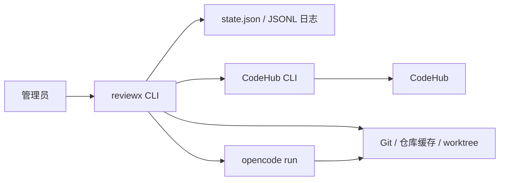

# ReviewX 技术架构设计

- 文档状态：Draft
- 版本：0.4
- 更新日期：2026-08-12
- 需求来源：[产品需求文档](./product-requirements.md)

## 1. 文档目的与核心决策

本文定义 ReviewX 首版的进程、命令、运行目录、外部接口、状态和 Agent 协议。产品范围、检视规则和评论内容以《[产品需求文档](./product-requirements.md)》为准。

核心决策：

1. 使用 TypeScript/Node 实现单一 `reviewx` CLI。
2. `reviewx run` 以前台单进程运行；MR 和 Agent 均顺序执行。
3. 每个 Agent 通过独立的 `opencode run` 子进程调用，不运行 OpenCode Server，不引入 OpenCode SDK。
4. CodeHub CLI 是唯一代码托管平台 CLI，负责仓库和 MR API 操作；本地 Git 只负责 clone、fetch、worktree 和只读查询。
5. 使用本地 `state.json` 保存最小状态，不运行数据库或队列。
6. Workflow 只准备仓库、worktree、分支和 commit 列表，不生成 diff 上下文包。
7. Agent 只读工作区，不运行项目代码；评论凭据只属于 Workflow。

首版不包含通用代码托管平台适配层、Webhook、多实例、Web 页面、inline 评论、知识库、报告或阶段恢复。

## 2. 运行拓扑与命令



对外命令只有两个：

```bash
reviewx repo add <repo-id> [--state runtime/state.json]

reviewx run \
  [--interval 10m] \
  [--agent-timeout 20m] \
  [--state runtime/state.json] \
  [--log runtime/reviewx.jsonl]
```

`reviewx repo add` 调用 `codehub repo view <repo-id> --output json` 验证 Project ID 和读取权限。验证通过后，在状态锁内重新读取状态、拒绝重复 ID，并原子写入新仓库；正在运行的 `reviewx run` 会在下一轮扫描前加载它。

`reviewx run` 获取单实例进程锁，启动后立即扫描一次，每轮结束后等待 `--interval` 再扫描。默认间隔为 10 分钟；一轮未结束时不启动下一轮。

`--agent-timeout` 是每个专家或裁判子进程的独立超时，默认 20 分钟，不是整个 MR 的总超时。

## 3. Runtime、状态与日志

### 3.1 目录

```text
runtime/
├── state.json
├── state.lock
├── reviewx.run.lock
├── reviewx.jsonl
├── repos/<repo-key>/
├── worktrees/<repo-key>/<mr-iid>/
└── runs/<run-id>/
    ├── expert-input.json
    └── judge-input.json
```

`runs/` 只保存当前运行的临时输入；校验后的 Agent 输出和评论正文在内存中传递。运行结束后删除对应 run 目录和 worktree。日志不内建轮转，由运行环境处理。

### 3.2 状态

`state.json` 只保存已登记仓库、MR 处理游标和历史问题，结构如下：

```ts
interface State { repositories: Record<string, RepositoryState>; }
interface RepositoryState { merge_requests: Record<string, MergeRequestState>; }
interface MergeRequestState {
  last_processed_updated_at?: string;
  finding_history: FindingHistory[];
}
interface FindingHistory {
  summary: { title: string; file: string; problem: string };
  publication_status: "confirmed" | "unknown";
  comment_id: string | null;
}
```

`repositories` 以 CodeHub Project ID 为键，`merge_requests` 以 MR IID 为键。

状态更新规则：

- 写入时获取 `state.lock`，重新读取状态，写同目录临时文件并原子替换；扫描和外部命令期间不持锁。
- `pass` 或 `duplicate_of` 成功后保存本次 `updated_at`。
- 新评论发布后保存 `confirmed` 历史、评论 ID 和重新查询得到的最新 `updated_at`。
- `WRITE_RESULT_UNKNOWN` 按第 7.1 节保存 `unknown` 历史并终止该次更新的自动重试。
- 失败、中断、发布前 MR 更新或关闭时不更新 `last_processed_updated_at`。
- 状态文件缺失时创建空状态；无法解析时停止写入，不能覆盖原文件。

### 3.3 日志

stdout 和 `reviewx.jsonl` 输出相同的 JSON Lines。每条记录按事件包含以下适用字段：

```ts
interface LogRecord {
  time: string;
  level: "info" | "error";
  event: string;
  run_id?: string;
  repo_id?: string;
  mr_iid?: string;
  updated_at?: string;
  result?: "pass" | "duplicate_of" | "new" | "publication_unknown" | "updated" | "closed" | "failed";
  error?: string;
  agent?: "design-reviewer" | "business-reviewer" | "code-reviewer" | "review-judge";
  agent_output?: string;
  agent_output_source?: "assistant_text" | "opencode_stdout";
  agent_output_chars?: number;
  agent_output_truncated?: boolean;
  duplicate_of_comment_id?: string | null;
  comment_id?: string | null;
}
```

仅当 OpenCode 退出成功、但事件流、Agent JSON 或结果 schema 无法校验时，失败的 `review_run_finished` 才附带 Agent 输出诊断。优先记录最终 assistant text；事件流本身损坏时记录 OpenCode stdout。输出先做凭据脱敏，再限制为 16 KiB；超限时保留首尾并通过 `agent_output_truncated` 标记。成功运行和明确的非零 Agent 退出不记录该正文。

## 4. CodeHub CLI 与 Git worktree

### 4.1 CodeHub CLI 契约

ReviewX 直接按以下固定契约调用 CodeHub CLI：

```bash
codehub repo view <repo-id> --output json
codehub mr list --project-id <repo-id> --state open --output json
codehub mr view <mr-iid> --project-id <repo-id> --output json
codehub mr commits <mr-iid> --project-id <repo-id> --output json
codehub mr comment create <mr-iid> \
  --project-id <repo-id> \
  --body <markdown> \
  --severity <suggestion|minor|major|fatal> \
  --output json
```

`repo_id` 等于 CodeHub Project ID。MR 的调用和状态主键是 `(repo_id, mr_iid)`；全局 `mr_id` 仅作为返回元数据，不得替代 IID。MR 使用 `state`、commit 使用 `sha`，评论成功结果使用 `comment_id`。

成功时 stdout 是直接 JSON 对象或数组；失败时 stdout 为空，stderr 是包含稳定 `code` 的 JSON 对象。ReviewX 同时校验退出码和错误 `code`，不能仅凭退出码分类。CodeHub 凭据使用 CLI 已有登录配置，不传给 Agent。

CodeHub CLI 会把服务端缺失的投影字段输出为 `null`。ReviewX 接受仓库展示字段、MR 的全局 ID/标题/草稿标记、Commit 元数据和评论解决状态为 `null`；MR 的 `repo_id`、`iid`、`state`、源/目标分支和 `updated_at` 仍是工作流必需字段，缺失时按无效输出失败。Commit 列表只用于帮助 Agent 理解意图和演进，元数据缺失不阻断最终 worktree 检视。

`mr list` 的返回数组直接作为本轮 Open MR 集合，不增加分页或改用其他接口。首版接受 CodeHub CLI 结果可能非全量的限制。

### 4.2 评论发布

Workflow 使用 Node 子进程参数数组调用 `mr comment create`，把裁判生成的完整 Markdown 作为一个 `--body` 参数传入，不经过 shell 拼接。严重等级映射固定为：

| ReviewX | CodeHub |
| --- | --- |
| Blocker | `fatal` |
| Critical | `major` |
| Major | `minor` |
| Minor | `suggestion` |

评论 Markdown 仍展示 ReviewX 原始等级。`WRITE_RESULT_UNKNOWN` 的处理规则见第 7.1 节。

### 4.3 Git 与 worktree 生命周期

1. 仓库登记通过 `repo view` 验证 Project ID；缓存不存在时再次读取 `clone_urls`。
2. 优先使用 SSH 地址；SSH clone 返回失败时清理不完整目录并自动尝试 HTTPS。只有 SSH 与 HTTPS 均不可用或均失败时，本次检视才失败；不使用明文 HTTP 地址。
3. 本地 Git clone 到 `runtime/repos/<repo-key>`；已有缓存时 fetch source 和 target 分支。
4. 清理遗留 worktree，在 `runtime/worktrees/<repo-key>/<mr-iid>` 创建新 worktree 并切换最新 source 分支。
5. 通过 `mr commits` 读取完整 commit 列表。
6. 专家和裁判共享只读 worktree，自行用代码搜索和只读 Git 理解最终整体净变化。
7. 无论成功或失败，都在结束路径中删除 worktree 和 run 临时目录。

`repo-key` 由仓库 ID 安全编码生成。Git 认证依赖运行机器已有的 SSH 或 Git Credential 配置，与 CodeHub CLI 登录凭据相互独立。

## 5. OpenCode Agent 与输出协议

### 5.1 配置、调用与超时

ReviewX 随程序分发四个 Agent：`design-reviewer`、`business-reviewer`、`code-reviewer` 和 `review-judge`。启动时设置：

```text
OPENCODE_CONFIG_DIR=<reviewx-opencode>
OPENCODE_CONFIG_CONTENT=<ReviewX 强制权限配置>
```

`OPENCODE_CONFIG_DIR` 加载 ReviewX Agent；`OPENCODE_CONFIG_CONTENT` 以运行时配置覆盖项目配置，防止待检视仓库扩大权限。每次调用创建独立进程和会话：

```bash
opencode run \
  --agent design-reviewer \
  --dir <worktree> \
  --file <run-dir>/expert-input.json \
  --format json \
  "检视当前 MR 的最终整体净变化，只输出约定 JSON。"
```

`--format json` 只保证 OpenCode 事件流为 JSONL。Agent 正文仍要求输出一个裸 JSON 对象；为兼容模型的展示习惯，workflow 会在裸 JSON 解析失败时提取正文中唯一的无语言或 `json` Markdown fenced block，并继续执行严格结构校验。常见围栏缩进、长度、反引号或波浪线形式以及围栏外说明文字可以兼容；多个 fenced block、无效 JSON 和无效结构仍判定失败。解析错误必须标明具体 Agent，且不得把原始正文写入日志。

三个专家按设计、业务、代码顺序执行，全部成功后才调用裁判。每个进程最多运行 `--agent-timeout`；超时后 ReviewX 终止进程并判定本次 Review Run 失败。

### 5.2 只读权限

运行时配置明确拒绝未授权能力，再放行读取、搜索和四类只读 Git 命令：

```yaml
permission:
  "*": deny
  read: allow
  glob: allow
  grep: allow
  list: allow
  edit: deny
  task: deny
  lsp: deny
  webfetch: deny
  websearch: deny
  external_directory: deny
  bash:
    "*": deny
    "git status*": allow
    "git log*": allow
    "git show*": allow
    "git diff*": allow
```

`edit: deny` 同时禁止 write、edit 和 apply_patch。Agent 不持有 CodeHub 凭据，也不能运行构建、测试、包管理或其他项目命令。

### 5.3 输入输出协议

专家输入只包含以 `repo_id`、`mr_iid` 标识的 MR 元数据、source/target 分支、worktree 路径和完整 commit 列表。裁判输入在此基础上增加三个专家结果，以及带发布状态和可空评论 ID 的历史问题。

JSON wire format 使用 `snake_case`，规范类型如下：

```ts
type Severity = "Blocker" | "Critical" | "Major" | "Minor";
type ExpertName = "design-reviewer" | "business-reviewer" | "code-reviewer";

interface Evidence { file: string; line: number; description: string; }

interface Finding {
  title: string;
  file: string;
  start_line: number;
  end_line: number;
  severity: Severity;
  tags: string[];
  rule_ids: string[];
  problem: string;
  trigger: string;
  impact: string;
  evidence: Evidence[];
  recommendation: string;
  confidence: number;
}

interface ExpertResult { expert: ExpertName; verdict: "findings" | "pass" | "insufficient_evidence"; findings: Finding[]; }

interface SelectedFinding extends Finding {
  example_code: string;
}

type JudgeResult =
  | { verdict: "pass" }
  | { verdict: "duplicate_of"; duplicate_comment_id: string | null }
  | { verdict: "new"; selected_finding: SelectedFinding; comment_markdown: string };
```

`pass` 和 `insufficient_evidence` 的专家结果不得包含候选问题。裁判每次只能返回联合类型中的一个分支；仅 `new` 包含符合 PRD 全部字段的评论 Markdown。

`opencode run --format json` 返回 JSON 事件流。ReviewX 按事件顺序重建完整的最终 assistant 文本，再将其作为单个 JSON 对象解析和校验；不能只读取最后一个文本事件。以下情况均判定失败：

- 子进程非零退出、超时或缺少最终响应。
- JSON 无法解析、包含多个顶层对象或不符合对应类型。
- 枚举、行号、置信度或裁判分支约束非法。

## 6. 扫描、检视与发布流程

一轮扫描顺序处理所有仓库和 MR：

1. 重新加载已登记仓库，通过 `mr list --state open` 查询 Open MR。
2. 只处理首次发现、此前失败或 `updated_at` 与游标不同的 MR。
3. 按第 4 章准备缓存、worktree、分支和 commit 列表。
4. 按第 5 章顺序调用三个专家和裁判。
5. `pass` 或 `duplicate_of` 不发布评论，按第 3 章保存处理游标。
6. `new` 在发布前通过 `mr view` 重新读取 MR；不是 Open 或 `updated_at` 已变化时放弃结果且不更新游标。
7. MR 未变化时按第 4.2 节发布一条普通评论；成功后保存 `confirmed` 历史、评论 ID 和刷新后的 `updated_at`，结果未知时按第 7.1 节处理。

每次 Review Run 最多发布一条新问题评论。Workflow 校验结构和执行裁判结果，不修改专家候选或代替 Agent 做语义判断。

## 7. 失败、锁与执行边界

### 7.1 失败与重跑

CodeHub CLI/Git 命令失败、worktree 准备失败、Agent 失败或状态无法安全写入时，本次运行记为 `failed`，不发布评论、不更新处理游标。发布前 MR 已更新或关闭时分别记为 `updated` 或 `closed`。

`WRITE_RESULT_UNKNOWN` 是唯一例外。它既可以来自 stderr 的稳定错误 `code`，也可以由退出成功但 `comment_id` 为 `null` 的评论结果触发；后者表示 CLI 无法提供足够证据确认写入结果：

1. 将本次问题摘要写入 `finding_history`，标记 `publication_status: "unknown"` 且 `comment_id: null`。
2. 再调用一次 `mr view`；成功时保存其 `updated_at`，失败时保存检视开始时的 `updated_at`。
3. 记录 `publication_unknown`，将该次 MR 更新视为已处理，不自动重试。
4. 后续 MR 更新仍可检视；裁判必须把 `unknown` 历史参与语义去重，相同问题返回 `duplicate_of`，其 `duplicate_comment_id` 为 `null`。

首版不做立即重试、阶段恢复或 Agent session 持久化。仍为 Open 的未完成 MR 会在下一轮从工作区准备阶段重新执行。

### 7.2 锁和原子写入

- `reviewx.run.lock` 保证单机只有一个扫描进程。
- `state.lock` 只覆盖一次状态读改写，使运行中的 `repo add` 不会破坏状态。
- 锁记录 PID 和创建时间；持有进程不存在时清理失效锁。
- 获取状态锁超时则命令失败，禁止无锁写入。
- 临时状态文件与目标文件位于同一目录，确保原子替换。

这些机制只解决单机进程竞争，不提供多实例协调。

### 7.3 执行边界

ReviewX 只在 `runtime/` 下创建和删除缓存、worktree、临时文件、状态和日志。Agent 对目标仓库只读；只有 ReviewX 主进程能够调用 CodeHub 评论命令。

## 8. 单机启动、验收与参考

### 8.1 启动

前置条件是 Node.js 22+、已配置 SSH 或 Git Credential 的 Git、已登录的 CodeHub CLI、可调用模型的 OpenCode CLI，以及随 ReviewX 部署的四个 Agent 配置。

```bash
reviewx repo add 123456
reviewx run
```

运行状态通过 stdout 或 `runtime/reviewx.jsonl` 观察。

### 8.2 架构验收

1. `repo view` 能登记有效 Project ID；无效或重复 ID 被拒绝，运行中添加的仓库下一轮生效。
2. MR 命令始终使用 Project ID 和 MR IID；仅 CLI 返回的首次、此前失败或 `updated_at` 变化的 Open MR 进入检视。
3. CodeHub CLI 只执行第 4.1 节的五类命令；本地 Git 按 SSH 优先规则准备 clone/fetch 和 worktree，不生成 diff 包。
4. 三个专家顺序执行；非零退出、非法结构或单个进程超过 20 分钟时停止本次运行。
5. `new` 按固定 severity 映射发布；`pass` 和 `duplicate_of` 不发布评论。
6. 检视期间 MR 更新或关闭时不评论；成功评论刷新 `updated_at`，`WRITE_RESULT_UNKNOWN` 记录未知历史且不自动重试。
7. 所有代码托管操作都对应第 4.1 节的 CodeHub CLI 命令；并发命令不损坏状态，Agent 不能编辑代码、运行项目命令、访问网络或发布评论。

### 8.3 官方参考

- [CodeHub CLI 产品需求文档](https://github.com/BlackLotusAL/CodeHubX/blob/main/docs/PRD.md)
- [OpenCode CLI](https://opencode.ai/docs/cli/)
- [OpenCode Config](https://opencode.ai/docs/config/)
- [OpenCode Agents](https://opencode.ai/docs/agents/)
- [OpenCode Permissions](https://opencode.ai/docs/permissions/)
